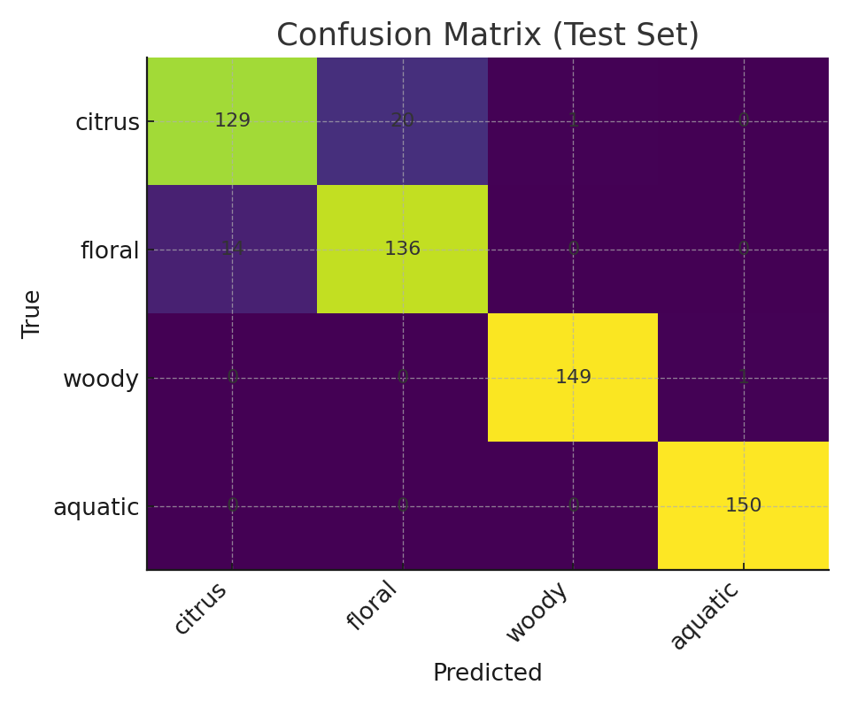

# Scent Lab — One-Page Report

**Date:** 2025-09-28

## Objective
Prototype a hardware-agnostic **AI scent classifier** to de-risk the software/test pipeline before sensor delivery.

## Data & Features
- Synthetic VOC/environment dataset (2,400 rows, 8 features): `raw_voc`, `gas_res`, `humidity`, `temperature`, `voc_delta`, `voc_slope`, `gas_ratio`, `humid_comp_voc`.
- 4 classes (perfume families): citrus, floral, aquatic, woody.

## Methods
- Models: k-NN, SVM (RBF), RandomForest using scikit-learn.
- Validation: 5-fold CV on train set; held-out test set.
- Metrics: accuracy, classification report, confusion matrix.

## Results
- **Best model:** `svm_rbf` — test accuracy: **0.940**
  - CV knn: mean=0.910, std=0.010
  - CV svm_rbf: mean=0.915, std=0.010
  - CV rf: mean=0.920, std=0.008



## Demo
```
# simulate a stream and classify frames live
python mock_stream.py floral | python classify_stream.py
```

## Swap-in Plan (when hardware arrives)
- Replace `mock_stream.py` with an I²C reader that outputs the same JSON keys per frame.
- Keep `classify_stream.py` unchanged; model and pipeline remain compatible.
